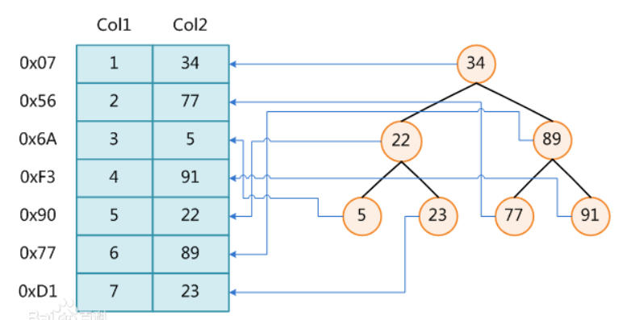

[toc]

# 聚合操作

## select 运算优先级

```MYSQL
(7)     SELECT 
(8)     [DISTINCT] <select_list>
(1)     FROM <left_table>
(3)     <join_type> JOIN <right_table>
(2)     ON <join_condition>
(4)     WHERE <where_condition>
(5)     GROUP BY <group_by_list>
(6)     HAVING <having_condition>
(9)     ORDER BY <order_by_condition>
(10)    LIMIT <limit_number>
```

## 聚合函数

| 方法          | 功能                 |
| ------------- | -------------------- |
| avg(字段名)   | 该字段的平均值       |
| max(字段名)   | 该字段的最大值       |
| min(字段名)   | 该字段的最小值       |
| sum(字段名)   | 该字段所有记录的和   |
| count(字段名) | 统计该字段记录的个数 |

1. 找出表中的最大攻击力的值？

```mysql
select max(attack) from sanguo;
```

2. 表中共有多少个英雄？

```mysql
select count(name) as number from sanguo;
```

3. 蜀国英雄中攻击值大于200的英雄的数量

```mysql
select count(*) from sanguo where attack > 200; 
```

> 注意： 此时select 后只能写聚合函数，无法查找其他字段。

## 聚合分组

使用`group by` 给查询的结果进行分组操作

给查询的结果进行分组

- 计算每个国家的平均攻击力 

```mysql
select country,avg(attack) from sanguo 
group by country;
```

>  注意： 使用分组时`select` 后的字段为`group by`分组的字段和聚合函数，不能包含其他内容。`group by`也可以同时依照多个字段分组，如`group by A，B` 此时必须`A,B`两个字段值均相同才算一组。

## 聚合筛选

使用 `having`对分组聚合后的结果进行进一步筛选

- 找出平均攻击力大于105的国家的前2名,显示国家名称和平均攻击力

```mysql
select country,avg(attack) 
from sanguo 
group by country
having avg(attack)>105
order by avg(attack) DESC
limit 2;
```

> 注意
>
> 1. `having`语句必须与`group by`联合使用。
> 2. `having`语句存在弥补了`where`关键字不能与聚合函数联合使用的不足,`where`只能操作表中实际存在的字段，`having` 操作的是聚合函数生成的显示列。

## 去重语句

使用`distinct`用于不显示字段重复值

- 表中都有哪些国家

```mysql
select distinct name,country from sanguo;
```

- 计算一共有多少个国家

```MYSQL
select count(distinct country) from sanguo;
```

> 注意: `distinct`和`from`之间所有字段都相同才会去重。

## 聚合运算

### 查询表记录时做数学运算

运算符 ：` +  -  *  /  %  `

- 查询时显示攻击力翻倍

```mysql
select name, attack*2 from sanguo;
```

- 更新蜀国所有英雄攻击力 * 2


```MYSQL
 update sanguo set attack=attack*2 where country='蜀国';
```

## 案例：聚合操作

使用 `book` 表

- 统计每位作家写的图书的价格之和
- 统计每个出版社出版的图书的平均价格
- 筛选出每个出版社图书有最高价格大于60的是哪个出版社
- 查看总共有多少位作者
- 统计所有有出版时间的图书的平均价格。

# 索引

## 索引约束

- 定义

  索引是一柄双刃剑，有好处也有一些使用约束

  索引是对数据库表中一列或多列的值进行排序的一种结构，使用索引可快速访问数据库表中的特定信息。

- 优缺点

  - 优点 ： 加快数据检索速度,提高查找效率

  - 缺点 ：占用数据库物理存储空间，当对表中数据更新时,索引需要动态维护,降低数据写入效率

> **注意 ：** 
>
> 1. 通常我们只在经常进行查询操作的字段上创建索引
> 2. 对于数据量很少的表或者经常进行写操作而不是查询操作的表不适合创建索引

## 索引创建

### 普通索引：字段值无约束，KEY标志为 `MUL`。

* 创建表时直接创建索引

```mysql
create table 表名(
    字段名 数据类型，
    字段名 数据类型，
    index 索引名(字段名),
    index 索引名(字段名)
);
```

* 在已有表中创建索引：

```mysql
create index 索引名 on 表名(字段名);
```

### 唯一索引(unique)：字段值不允许重复，但可为 NULL，KEY标志为 `UNI`

- 创建表时之间创建索引

```MYSQL
create table 表名(
    字段名 数据类型，
    字段名 数据类型，
    unique index 索引名(字段名)
);
```

- 在已有表中创建索引：

```MYSQL
create unique index 索引名 on 表名(字段名);
```

### 主键索引

主键索引（`PRI`）：一个表中只能有一个主键字段, 主键字段不允许重复,且不能为`NULL`，`KEY`标志为`PRI`。通常设置记录编号字段`id`,能唯一锁定一条记录。

在之前的学习中已经学习过如何创建铸件索引，在这里看一下主键索引其他操作。

- 已有表中添加主键索引

```MYSQL
 alter table 表名 add primary key(id);
```

- 添加复合主键

```mysql
primary key (uid, pid)
```

- 删除主键索引

```MYSQL
alter table 表名 drop primary key;  # 删除主键
```

## 查看删除索引

查看索引：

- 通过`key` 标志判断索引：`desc 表名`;
- 查看索引详细信息：`show index from 表名`;

删除索引：

```MYSQL
drop index 索引名 on 表名;
```

## 索引结构

### 树状结构

`mysql`最为常用的就是使用`B-Tree`结构构建索引表。建立索引之后，数据库将会自行维护类似的树形索引，便于查询。但是树形索引的维护，使得对数据的增加和删除操作变得耗时，同样也增加了数据所占用的存储资源。



### B+树

`B+`树是一种特殊的树型结构。有如下特点：
树中每个非叶节点最多有`m`个子节点；
根节点至少有两个子树，除根外，所有的非叶节点至少有`[m/2]`个子节点，有`n`个子节点的非叶节点有`n-1`个关键值域；
所有叶子节点处于同一层上，包含了全部关键值以及指向相应数据对象存放地址的指针，且叶节点本身按键值从小到大顺序链接；
所有的非叶节点可以看作为索引部分，节点中关键值与指向子树的指针构成了对树的索引项。


# 外键约束

## 外键定义

约束 : 约束是一种限制，它通过对表的行或列的数据做出限制，来确保表的数据的完整性、唯一性

外键约束: 建立表与表之间的某种约束的关系，由于这种关系的存在，能够让表与表之间的数据，更加的完整，关连性更强。

## 外键作用

- 由数据库自身保证数据一致性，完整性，更可靠，因为程序很难100％保证数据的完整性，而用外键即使在数据库服务器当机或者出现其他问题的时候，也能够最大限度的保证数据的一致性和完整性。
- 设置外键约束的两个表之间会具有父子关系，即子表中外键的字段的取值范围由父表所决定
- 设置外键一定程度上降低数据库的速度
- 子表的外键字段的数据类型和父表中要一致

## 建立外键约束

`foreign key` 外键的定义语法：

```mysql
[CONSTRAINT symbol] FOREIGN KEY [id] (index_col_name, ...) REFERENCES tbl_name 
(index_col_name, ...) [ON DELETE {RESTRICT | CASCADE | SET NULL | NO ACTION}] 
[ON UPDATE {RESTRICT | CASCADE | SET NULL | NO ACTION}]
```

该语法可以在 `CREATE TABLE` 和 `ALTER TABLE` 时使用，如果不指定`CONSTRAINT symbol`，`mysql`会自动生成一个名字,可以通过`show  create table [tb]`命令查看

通过外键名称解除外键约束：

```mysql
alter table [tb] drop foreign key [foreign_key];
```

注意，删除外键后发现`desc`查看索引标志还在，其实外键也是一种索引，需要将外键名称的索引删除之后才可以。

## 级联动作

- `restrict(默认)`：`on delete restrict  on update restrict`  

  当主表删除记录时，如果从表中有相关联记录则不允许主表删除  

  当主表更改主键字段值时，如果从表有相关记录则不允许更改

- `cascade `：数据级联更新  `on delete cascade  on update cascade`  

  当主表删除记录或更改被参照字段的值时,从表会级联更新

- `set null`：`on delete set null    on update set null ` 

  - 当主表删除记录时，从表外键字段值变为`null  `
  - 当主表更改主键字段值时，从表外键字段值变为`null`

- `no action`：同 `restrict`，都是立即检查外键限制