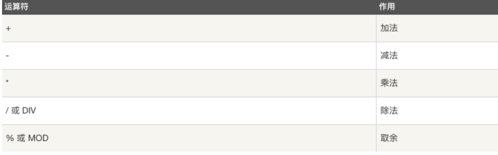
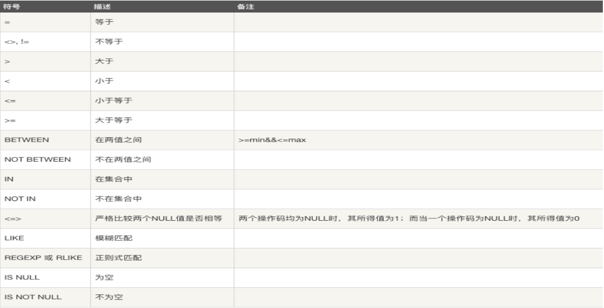
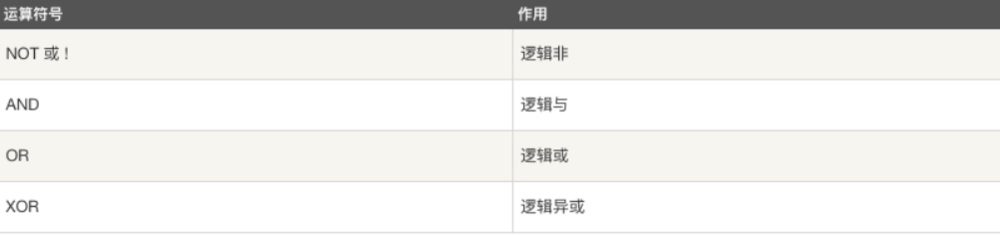
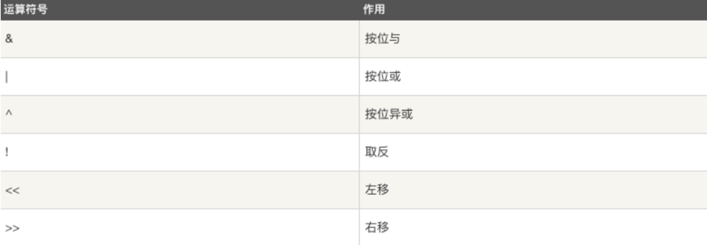
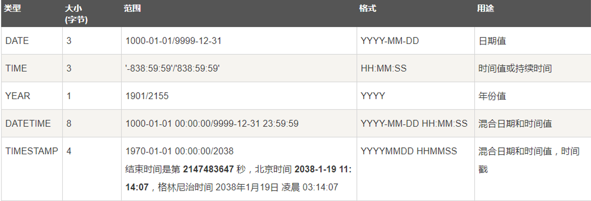

[TOC]

# 复习

## 创建数据库

```mysql
-- 查看已有库： 
show databases;

-- 数据库，编码为utf8
create database 库名 character set utf8;
create database 库名 charset=utf8;

-- 查看创建库的语句：
show create database 库名;

-- 查看库创建方法
show create database 库名;

-- 查看当前所在库：
select database();

-- 使用数据库
use 库名;

-- 删除库：
drop database 库名;
```

## 创建数据表

```mysql
create table 表名(
     字段名 数据类型 字段约束,
     字段名 数据类型 字段约束, 
     ...
     字段名 数据类型 字段约束
);
```

## 创建数据库、数据表

1.  创建一个数据库`books` 采用`utf8`编码

2.  在该数据库下创建一个数据表`book`，字段如下：

    `id title author price publication(出版社) comment(评论)`

    字段类型及约束条件自己拟定

    ```mysql
    CREATE DATABASE books charset=utf8;
    use books;
    create table book (
    	id int primary key auto_increment, -- 主键 自增长
        title varchar(30) not null, -- 不定长 不为空
        author varchar(30) not null, -- 不定长 不为空
        price decimal(6,2), -- 浮点型
        publication varchar(50) not null, -- 不定长 不为空
        comment text -- 字符串类型
    )
    ```

# 增删改查语句

## insert 语句

```mysql
-- 语法格式：
insert into 表名 values(值1), (值2),...;
insert into 表名(字段1,...) values(值1,...),...;

-- 向学生表中插入数据
insert into class_1 values 
	(2,'Baron',10,'m',91),
	(3,'Jame',9,'m',90);
```

## select 语句

```mysql
-- 语法格式：
	select * from 表名 [where 条件];
	select 字段名1, 字段名2 from 表名 [where 条件];

-- eg:
	select * from class_1;
	select name,age from class_1;
	select * from class_1 where age>10;
```

## where 语句

`where`子句在`sql`语句中扮演了重要角色，主要通过一定的运算条件进行数据的筛选。

### 算数运算符



### 比较运算符



### 逻辑运算符



### 位运算符号



## update 语句

```mysql
-- 语法格式：
	update 表名 set 字段1=值1,字段2=值2,... where 条件;
	
-- e.g. 
	update class_1 set age=11 where name='Abby';
```

## delete 语句

```mysql
-- 语法格式：
	delete from 表名 where 条件;
	
-- 注意:delete语句后如果不加where条件,所有记录全部清空
     
-- e.g. 
	delete from class_1 where name='Abby';
```

## 案例：在数据表中 `book` 中插入几条数据

-   作者：老舍、鲁迅、钱钟书、沈从文、冰心、韩寒、郭敬明
-   价格：30 -- 120
-   出版社：中国文学出版社、中国教育出版社、机械工业出版社

1.  查找价格30多的图书
2.  查找出版社为中国教育出版社的
3.  查找老舍写的，中国文学出版社的
4.  查找备注不为空的
5.  查找价格超过60的，只看书名和价格
6.  查找价格超过100的活着鲁迅写的

## alter 语句

### 添加字段

```mysql
alter table 表名 add 字段名 数据类型 字段约束;
alter table 表名 add 字段名 数据类型 first;
alter table 表名 add 字段名 数据类型 after 字段名;
```

### 删除字段

```mysql
alter table 表名 drop 字段名;
```

### 修改字段类型

```mysql
alter table 表名 modify 字段名 新数据类型 字段约束;
```

### 修改字段名

```mysql
alter table 表名 change 旧字段名 新字段名 新数据类型;
```

### 表重命名

```mysql
alter table 表名 rename 新表名;
```

# 时间类型

## 时间和日期类型:

-   日期DATE，日期时间DATETIME，时间戳TIMESTAMP

-   时间TIME

-   年份YEAR



## 时间格式

```mysql
date ："YYYY-MM-DD"

time ："HH:MM:SS"

datetime ："YYYY-MM-DD HH:MM:SS"

timestamp ："YYYY-MM-DD HH:MM:SS"
```

**注意 :**

1.  datetime ：以系统时间存储 
2.  timestamp ：以标准时间存储但是查看时转换为系统时区，所以表现形式和datetime相同

## 时间日期函数

-   now() 返回服务器当前日期时间,格式对应datetime类型

-   curdate() 返回当前日期，格式对应date类型

-   curtime() 返回当前时间，格式对应time类型

## 时间运算

```mysql
语法格式:
select * from 表名  where 字段名 运算符 (时间-interval 时间间隔单位);

时间间隔单位:   
	2 hour | 1 minute | 2 second | 2 year | 3 month |  1 day

-- ：查找注册时间在一周以内的记录
select * from marathon where registration_time > (now()-interval 7 day);

```

## 数据库操作练习

使用`book` 表完成

1.  将林家铺子的价格修改为45元
2.  增加一个字段，出版日期，类型为`date`，放在价格后面
3.  删除所有老舍的图书的出版日期为2012-5-4
4.  删除所有价格在80元以上的图书
5.  修改价格的字段类型`decimal(5,2)`

# 高级查询语句

## 模糊查询

LIKE用于在where子句中进行模糊查询，SQL LIKE 子句中使用百分号 %来表示任意0个或多个字符，下划线_表示任意一个字符。

使用 LIKE 子句从数据表中读取数据的通用语法：

```mysql
SELECT field1, field2,...fieldN FROM table_name WHERE field1 LIKE condition1

-- e.g. 
select * from class_1 where name like 'A%';
```

## as 用法

在sql语句中as用于给字段或者表重命名，特别是一些名字比较长的表或者字段，可以简化表和字段的表达方式。

```mysql
select name as 姓名,age as 年龄 from class_1;
select * from class_1 as c where c.age > 17;
```

## 排序

```mysql
ORDER BY 子句来设定你想按哪个字段哪种方式来进行排序，再返回搜索结果。

使用 ORDER BY 子句将查询数据排序后再返回数据：
SELECT field1, field2,...fieldn from table_name1 where field1 ORDER BY field1 [ASC [DESC]]

默认情况ASC表示升序，DESC表示降序
select * from class_1 where sex='m' order by age;

where order by
```

## 分页

```mysql
LIMIT 子句用于限制由 SELECT 语句返回的数据数量 或者UPDATE,DELETE语句的操作数量带有 LIMIT 子句的 SELECT 语句的基本
语法如下：

SELECT column1, column2, columnN FROM table_name WHERE field LIMIT [num]
```

## 联合查询

```mysql
UNION 操作符用于连接两个以上的 SELECT 语句的结果组合到一个结果集合中。多个 SELECT 语句会删除重复的数据。

UNION 操作符语法格式：

SELECT expression1, expression2, ... expression_n FROM tables[WHERE conditions] 
UNION [ALL | DISTINCT] 
SELECT expression1, expression2, ... expression_n FROM tables [WHERE conditions]; 

-- 默认情况下 UNION 操作符已经删除了重复数据，所以 DISTINCT 修饰符对结果没啥影响。如果是ALL则返回所有结果集，包含重复数据。

select * from class_1 where sex='m' UNION ALL select * from class_1 where age > 9;

```

## 子查询

-   定义 ： 当一个select语句中包含另一个select 查询语句，则称之为有子查询的语句

-   子查询出现的位置：

1.  from 之后 ，此时子查询的内容作为一个新的表内容，再进行外层select查询

```mysql
select name 
from 
	(select * from class_1 where sex='m') as s 
where 
	s.score > 90;
```

2.  where子句中，此时select查询到的内容作为外层查询的条件值

```mysql
select * from class_1 where age = (select age from class_1 where name='Tom');
```

## 案例：数据库高级查询

-   创建库：`hero`
-   创建表：`sanguo`
-   字段：`id name genger county attack defense`
-   参考数据：
    -   `attack > 100`
    -   `defence 0 - 100`
    -   魏：曹操 司马懿 夏侯渊 张辽 甄姬
    -   蜀：刘备 关羽 赵云 诸葛亮 张飞 孙尚香
    -   吴：周瑜 大乔 小乔 陆逊 吕蒙

# 综合训练

- 查找所有蜀国人信息，按照攻击力排名
- 将赵云的攻击力设为360防御力，设置为70
- 吴国英雄攻击力超过300的改为300(最多改2个)
- 查找攻击力高于250的魏国英雄的名字和攻击力
- 将所有英雄攻击力按照降序排序，如果攻击力相同则按照防御力降序排序
- 查找所有名字为3个字的英雄
- 找到魏国防御力前2名的英雄
- 找到攻击力比魏国攻击力者还要高的蜀国英雄
- 找到所有女性角色中攻击力比诸葛亮还要高的英雄

