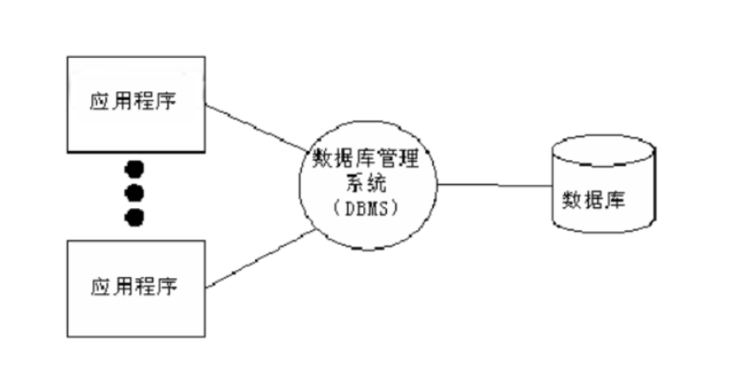
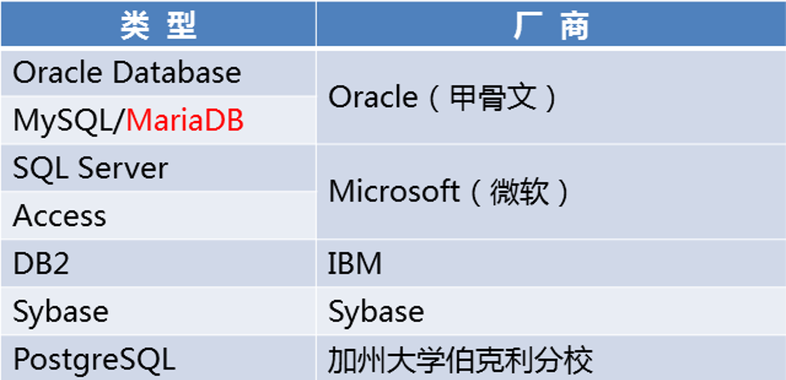
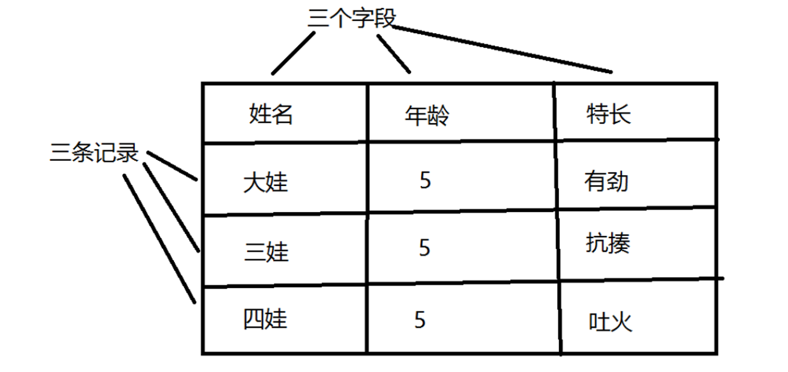
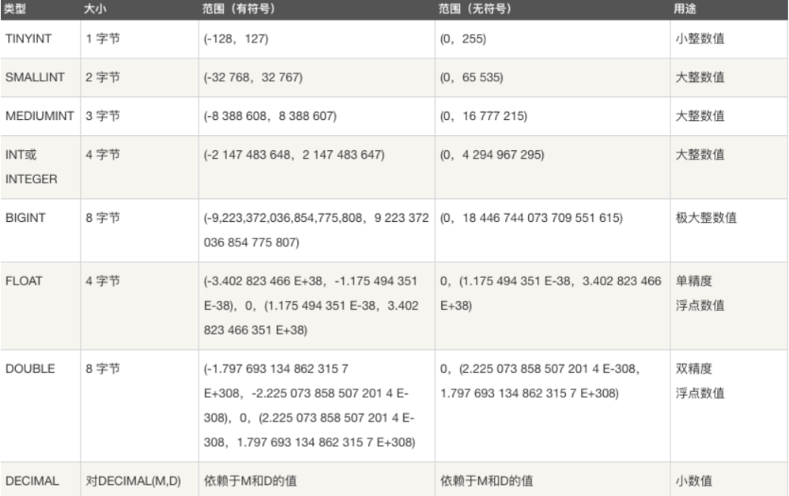
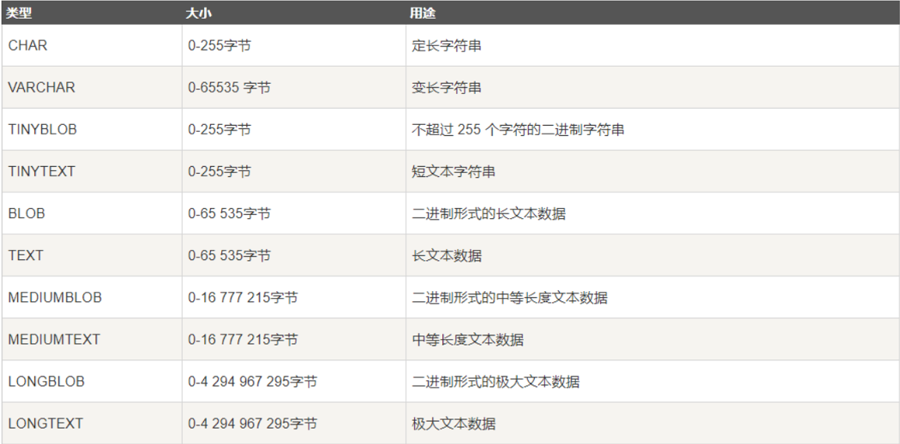

[TOC]

# 数据库概述

## 数据存储阶段

1.  人工管理阶段缺点 ： 数据无法共享,不能单独保持,数据存储量有限。

2.  文件管理阶段 （.txt .doc .xls）  

    -   优点 ： 数据可以长期保存,可以存储大量的数据,使用简单。

    -   缺点 ：数据一致性差,数据查找修改不方便,数据冗余度可能比较大

3.  数据库管理阶段。

    -   优点 ： 数据组织结构化降低了冗余度,提高了增删改查的效率,容易扩展,方便程序调用，做自动化处理。

    -   缺点 ：需要使用sql 或者 其他特定的语句，相对比较复杂。

## 基础概念

-   数据 ： 能够输入到计算机中并被识别处理的信息集合
-   数据结构 ：研究一个数据集合中数据之间关系的
-   数据库 ： 按照数据结构，存储管理数据的仓库。数据库是在数据库管理系统管理和控制下，在一定介质上的数据集合。
-   数据库管理系统 ：管理数据库的软件，用于建立和维护数据库
-   数据库系统 ： 由数据库和数据库管理系统，开发工具等组成的集合

## 数据库应用

数据库的使用已经无处不在，金融机构、游戏网站、购物网站、论坛网站 等等。这些公司的数据都需要在数据库中进行存储。



## 数据库分类

-   关系型数据库和非关系型数据库   

    -   关系型： 采用关系模型（二维表）来组织数据结构的数据库 

    -   非关系型： 不采用关系模型组织数据结构的数据库

-   开源数据库和非开源数据库

    -   开源：MySQL、SQLite、MongoDB

    -   非开源：Oracle、DB2、SQL_Server

## 常见数据库



# MySQL 数据库

## MySQL 简介

最为著名、应用最广泛的开源数据库软件

-   最早隶属于瑞典的MySQL AB公司

-   2008年1月 MySQL AB被Sun收购

-   2009年4月 Sun被Oracle收购


官网：https://www.mysql.com

MySQL版本 - 社区版和商业版

MySQL Community Server 社区版本，开源免费，但不提供官方技术支持。

MySQL Enterprise Edition 企业版本，需付费，可以试用30天。

MySQL Cluster 集群版，开源免费。可将几个MySQL Server封装成一个Server。

MySQL Cluster CGE 高级集群版，需付费。

## MySQL 特点

-   MySQL是开源数据库，使用C和C++编写 

-   MySQL能够工作在众多不同的平台上

-   MySQL提供了用于C、C++、Python、Java、Perl、PHP、Ruby众多语言的API

-   MySQL存储结构优良，运行速度快

-   MySQL功能全面丰富

## MySQL 安装

1.  Ubuntu安装MySQL服务

    -   安装服务端: `sudo apt-get install mysql-server`

    -   安装客户端: `sudo apt-get install mysql-client`

    -   配置文件：`/etc/mysql`

    -   命令集：` /usr/bin`

    -   数据库存储目录 ：`/var/lib/mysql`

2.  Windows安装MySQL

    -   官网下载MySQL安装包[https](https://dev.mysql.com/downloads/mysql)[://](https://dev.mysql.com/downloads/mysql)[dev.mysql.com/downloads/mysql](https://dev.mysql.com/downloads/mysql)

    -   直接双击安装即可

## MySQL 服务

```bash
查看MySQL服务状态: sudo /etc/init.d/mysql status

启动服务：sudo /etc/init.d/mysql start | stop | restart 
  	或者 service mysql start|stop|restart

客户端连接服务：mysql -h主机地址 -u用户名 -p密码
本地连接可省略 -h 选项: mysql -uroot -p123456

关闭服务连接 ： ctrl-d  或者  exit
```

## 小结

-   理解数据库的基本概念
-   掌握 `mysql` 的基本特征
-   掌握 `mysql` 的安装启动方法

# 数据库和数据表

## 关系型数据库

我们已经知道MySQL是一个关系型的数据库，那么关系型数据库又有哪些特征呢?

关系型数据库指的是通过关系模型构建的数据库，结构如下：

数据元素 --> 记录 -->数据表 --> 数据库


-   数据表（table） ： 存放数据的表格 

-   字段（column）： 每个列，用来表示该列数据的含义

-   记录（row）： 每个行，表示一组完整的数据



## SQL 语言

### 定义

SQL（Structured Query Language ) 结构化查询语言，是一种数据库查询和程序设计语言，用于存取数据以及查询、更新和管理关系数据库系统。同时也是数据库脚本文件的扩展名。

### SQL 语句特点

-   SQL语言基本上独立于数据库本身

-   各种不同的数据库对SQL语言的支持与标准存在着细微的不同

-   每条命令必须以 ; 结尾

-   SQL命令不区分字母大小写

### 创建数据库

1.  查看已有库： 

```mysql
show databases;
```

2.  创建库：

```mysql
create database 库名 [character set utf8]；
```

```mysql
-- 创建stu数据库，编码为utf8

create database stu character set utf8;

create database stu charset=utf8;
```

3.  查看创建库的语句：

```mysql
show create database 库名;
```

```mysql
-- 查看stu创建方法

show create database stu;
```

4.  查看当前所在库：

```mysql
select database();
```

5.  切换库：

```mysql
use 库名;
```

```mysql
-- 使用stu数据库

use stu;
```

6.  删除库：

```mysql
drop database 库名;
```

```mysql
-- 删除test数据库
drop database test;
```

### 创建数据表

#### 数据表设计

-   根据业务需要设计存储内容
-   根据存储内容构建表的字段结构
-   根据字段数据特征确定字段类型

#### 小结

-    理解关系型数据库特征
-   掌握 `SQL` 语言特点
-   掌握数据库的常见方法

### 创建数据表

```mysql
-- 创建表:

create table 表名(
     字段名 数据类型 字段约束,
     字段名 数据类型 字段约束, 
     ...
     字段名 数据类型 字段约束
);
```

### 数据类型支持





-   `ENUM`：从给定值的集合中选择某一个值

    定义格式：`ENUM(值1,值2,… …,值N)`

-   `SET`：从给定值的集合中选择一个或多个值

    定义格式：`SET(值1,值2,… …,值N)`

### 字段约束

-   如果你想设置数字为无符号则加上 `unsigned`

-   如果你不想字段为 `NULL` 可以设置字段的属性为 `NOT NULL`， 在操作数据库时如果输入该字段的数据为`NULL` ，就会报错。

-   `DEFAULT` 表示设置一个字段的默认值

-   `AUTO_INCREMENT`定义列为自增的属性，一般用于主键，数值会自动加1。

-   `PRIMARY KEY` 关键字用于定义列为主键。主键的值不能重复,且不能为空。

### 数据表示例

```mysql
-- 创建班级表

-- 创建班级表
CREATE TABLE class_1 (
        -- 字段　字段类型　约束条件,
        id int primary key auto_increment, -- 整型　主键　自增
        name varchar(32) not null, -- 不定长　不为空
        age tinyint unsigned not null, -- 整型　无符号　不为空
        sex enum('m', 'w', 'o'),-- 枚举类型　
        score float default 0.0 -- 浮点型　默认值为0.0
);

-- 创建兴趣表
create table interest (
    id int primary key auto_increment, -- 整型 主键 自增长
    name varchar(32) not null, -- 不定长 不为空
    hobby set('sing', 'dance', 'draw'), -- 枚举类型
    level char not null, -- 定长 不为空
    price decimal (6,2), -- 浮点型
    remark text -- 字符串
);
```

### 数据表操作

```mysql
-- 查看数据表： 
show tables；

-- 查看已有表的字符集： 
show create table 表名;

-- 查看表结构： 
desc 表名;

-- 删除表： 
drop table 表名;
```

### 案例：创建数据库、数据表

1.  创建一个数据库`books` 采用`utf8`编码

2.  在该数据库下创建一个数据表`book`，字段如下：

    `id title author price publication(出版社) comment(评论)`

    字段类型及约束条件自己拟定

## 小结

-   掌握`MySQL` 数据类型
-   掌握数据库的创建和操作方法