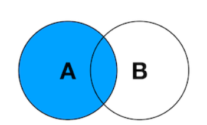

[toc]


# 表关联关系和关联查询

## 表关联设计

### 一对一模型

一张表的一条记录一定只能与另外一张表的一条记录进行对应，反之亦然。

- 举例 : 

  学生信息和学籍档案，一个学生对应一个档案，一个档案也只属于一个学生。

- 学生表 

```MYSQL
-- 学生表
create table student(
    id int primary key auto_increment,
    name varchar(50) not null
);
```

- 档案表 

```MYSQL
-- 档案表
create table record(
    id int primary key auto_increment,
    comment text not null,
    -- 重点 一对一关联
    st_id int unique, 
    foreign key(st_id) -- 外键关联字段
    references student(id) -- 和谁关联 
    -- 级联动作
    on delete cascade on update cascade
);
```

### 一对多模型

一张表中有一条记录可以对应另外一张表中的多条记录；但是反过来，另外一张表的一条记录只能对应第一张表的一条记录，这种关系就是一对多或多对一

- 举例： 

  一个人可以拥有多辆汽车，每辆车登记的车主只有一人。

- 车主表：

```MYSQL
-- 车主表  --> 主表
create table people(
    id varchar(32) primary key,
    name varchar(50),
    sex enum('m','w'),
    age int
);
```

- 汽车表：

```MYSQL
-- 汽车表  --> 从表
create table car(
    id varchar(32) primary key,
    name varchar(50),
    price decimal(10, 2),
    -- 重点
    pid varchar(32), -- 作为外键和主表的主键类型保持一致
    -- 创建关联
    constraint car_fk foreign key(pid) references people(id)
);
```

### 多对多模型

一对表中（A）的一条记录能够对应另外一张表（B）中的多条记录；同时B表中的一条记录也能对应A表中的多条记录

- 举例：

  一个运动员可以报多个项目，每个项目也会有多个运动员参加,这时为了表达多对多关系需要单独创建关系表。

- 运动员表：

```MYSQL
create table athlete(
    id int primary key auto_increment,
    name varchar(50),
    age tinyint,
    country varchar(50),
    descirption text
);
```

- 项目表：

```MYSQL
-- 主表 项目表
create table item (
    id int primary key auto_increment,
    rname varchar(50)
);
```

- 关系表：

```MYSQL
create table athlete_item(
    aid int not null,
    tid int not null,
    primary key(aid, tid), -- 复合主键

    -- 建立相应的关系
    -- 创建 和 运动员表 的外键关联
    constraint athlete_fk -- 外键名称
    foreign key(aid) -- 设置哪个字段为外键
    references athlete(id), -- 关联哪个表的那个字段

    -- 创建 和 项目表 的外键关联
    constraint item_fk
    foreign key (tid)
    references item(id)
);
```

### 案例：表关系设计


建立用户，朋友圈，评论点赞信息的表关系。

1. 设计一下存储三者信息需要多少表
2. 设计表之间的关系
3. 建立表

### E-R 模型

`E-R`模型`(Entry-Relationship)`即 实体-关系 数据模型,用于数据库设计。用简单的图`(E-R图)`反映了现实世界中存在的事物或数据以及他们之间的关系。

- 实体： 描述客观事物的概念
- 属性： 实体具有的某种特性
- 关系： 实体之间的联系

#### E-R 模型示例

矩形框代表实体,菱形框代表关系,椭圆形代表属性：


### 案例：将书籍数据表拆分

拆分`book` 数据表为三个表：书籍信息，作家信息，出版社信息

1. 设计三者之间的关系，画出`E-R`图
2. 根据`E-R`图建立三张表

## 表关联查询

如果多个表存在一定关联关系，可以多表在一起进行查询操作，其实表的关联查询与外键约束之间并没有必然联系，但是基于外键约束设计的具有关联性的表往往会更多使用关联查询查找数据。

#### 多表联合查询

多个表数据可以联合查询，语法格式如下：

```MYSQL
select  字段1,字段2... from 表1,表2... [where 条件];

-- EG:
select * from dept,person where dept.id = person.dept_id;
```

### 内连接查询

内连接查询只会查找到符合条件的记录，其实结果和表关联查询是一样的,官方更推荐使用内连接查询。

```MYSQL
-- 语法格式：
SELECT 字段列表
    FROM 表1  INNER JOIN  表2 -- 表
ON 表1.字段 = 表2.字段; -- 交集条件

-- e.g.
select * from 
	person inner join  dept  
	on  person.dept_id = dept.id;
```


### 左连接查询 

左连接  : 左表为主表，显示右表中与左表匹配的项

```MYSQL
-- 语法格式：
SELECT 字段列表
    FROM 表1  LEFT JOIN  表2 -- 左表 表1 右表 表2
ON 表1.字段 = 表2.字段; -- 交集

-- e.g.：
select * from person left join  dept  on  person.dept_id =dept.id;
```



### 右连接查询

右连接 ：右表为主表，显示左表中与左表匹配的项。

```mysql
-- 语法格式：
SELECT 字段列表
    FROM 表1  RIGHT JOIN  表2
ON 表1.字段 = 表2.字段;

-- e.g.：
select * from person right join  dept  on  person.dept_id =dept.id；
```


# 试图和数据导出

## 试图介绍

视图是存储的查询语句,当调用的时候,产生结果集,视图充当的是虚拟表的角色。其实视图可以理解为一个表或多个表中导出来的表，作用和真实表一样，包含一系列带有行和列的数据 视图中，用户可以使用`SELECT`语句查询数据，也可以使用`INSERT，UPDATE，DELETE`修改记录，视图可以使用户操作方便，并保障数据库系统安全。

## 试图功能

优点：

1. 是对数据的一种重构，不影响原数据表的使用。  
2. 简化高频复杂操作的过程，就像一种对复杂操作的封装。  
3. 提高安全性，可以给不同用户提供不同的视图  
4. 让数据更加清晰

缺点:

1. 视图的性能相对较差，从数据库视图查询数据可能会很慢。
2. 表依赖关系处理麻烦，根据数据库的基础表创建一个视图。每当更改视图或者原表时，另一个也会修改。

## 试图操作

### 创建试图

```mysql
-- 语法结构：
CREATE [OR REPLACE] VIEW [view_name] AS [SELECT_STATEMENT];

-- 释义：
CREATE VIEW： -- 创建视图
OR REPLACE : -- 可选，如果添加原来有同名视图的情况下会覆盖掉原有视图
view_name ： -- 视图名称
SELECT_STATEMENT ：-- SELECT语句

-- 查看数据库下有哪些视图
show full tables in 库名 where table_type like 'VIEW';
-- eg
show full tables in hero where table_type like 'VIEW';
```

### 删除试图

```mysql
drop view [IF EXISTS] 视图名；

IF EXISTS -- 表示如果存在，这样即使没有指定视图也不会报错。
```

### 修改试图

```MYSQL
-- 参考创建视图，将create关键字改为alter
alter view  c1 as select name,age,score from class_1;

-- 视图表的增删改查操作
-- 视图的增删改查操作与一般表的操作相同，使用insert update delete select即可，但是原数据表的约束条件仍然对视图产生作用。
```

## 复制数据表

### 表的复制

1. 表能根据实际需求复制数据
2. 复制表时不会把KEY属性复制过来

```mysql
-- 语法：
create table 表名 select 查询命令;
```

### 数据备份

```mysql
-- 备份命令格式： 
mysqldump -u用户名 -p 源库名 > ~/stu.sql

--all-databases  -- 备份所有库
db_name          -- 备份单个库
-B 库1 库2 库3    -- 备份多个库
库名 表1 表2 表3   -- 备份指定库的多张表

-- 恢复命令格式
mysql -uroot -p 目标库名 < stu.sql
-- 注意：目标库名 必须存在
```

